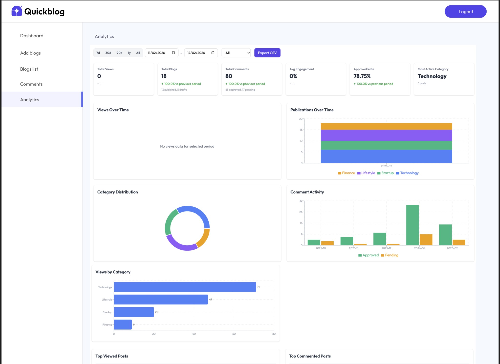

# Demo: Implementing Blog Analytics Dashboard with Multi-Agent Workflow

This guide demonstrates how to implement a complete Blog Analytics Dashboard in QuickBlog using Cursor's multi-agent orchestration. 
The workflow leverages specialized subagents running in parallel to deliver a production-quality feature fast.

## Final Result



The analytics page includes:
- **KPI stat cards** — Total Views, Total Blogs, Total Comments, Avg Engagement, Approval Rate, Most Active Category
- **Interactive charts** — Views Over Time, Publications Over Time, Category Distribution, Comment Activity, Views by Category
- **Data tables** — Top Viewed Posts, Top Commented Posts, Recent Comments
- **Filters** — Period quick-select (7d/30d/90d/1y/All), custom date range, category dropdown
- **Export** — CSV download with all metrics
- **Drill-down** — Click chart elements to explore data

## Prerequisites

Before starting, ensure you have:
- QuickBlog server running (`npm run server` in `server/`)
- QuickBlog client running (`npm run dev` in `client/`)
- MongoDB running via Docker (`npm run db:start` in `server/`)
- Test data seeded (`npm run seed` in `server/`)

## Multi-Agent Workflow Overview

This feature is built using a 5-step multi-agent workflow, where specialized Cursor subagents handle different aspects of the implementation in parallel:

| Step | Agent | Purpose |
|------|-------|---------|
| 1 | `requirements-planner` | Analyze design, create structured requirements |
| 2 | Planning (manual) | Split requirements into parallel implementation tracks |
| 3 | `implementor` (×N) | Implement each track in parallel |
| 4 | `plan-verifier` | Verify implementation matches the plan |
| 5 | `backend-reviewer` + `react-reviewer` | Review code, fix issues |

---

## Step-by-Step Implementation

### Step 0: Checkout Feature Branch

```bash
git checkout -b feat/analytics-dashboard
```

### Step 1: Requirements Planning

Use the `requirements-planner` subagent to analyze the design document and create structured, categorized requirements.

**Open a new Cursor chat and paste this prompt:**

```
/requirements-planner let's plan the next requirements with this subagent
for this feature. You can categorize things and run in parallel
@docs/feature-requirements/2026-02-11-blog-analytics-dashboard-design.md
```

**What this does:**
- Reads the design document ([`docs/feature-requirements/2026-02-11-blog-analytics-dashboard-design.md`](docs/feature-requirements/2026-02-11-blog-analytics-dashboard-design.md))
- Analyzes the analytics dashboard screenshot
- Breaks the feature into categorized requirement documents
- Creates structured acceptance criteria for each requirement

**Expected output:** 3-4 requirement documents in `docs/requirements/`:

| Document | Scope |
|----------|-------|
| `analytics-backend-requirements.md` | Data model (BlogView), view tracking API, analytics endpoints, CSV export |
| `analytics-dashboard-frontend-requirements.md` | Page layout, KPI cards, charts (Recharts), tables, loading/empty/error states |
| `analytics-interactivity-fixtures-requirements.md` | Period/category filters, drill-down, export button, seed data generation |

> **Tip:** Review the generated requirements carefully. The more precise they are, the better the implementation will be.

> **Backup:** If your generated requirements differ or you want a reference, pre-made examples are available in [`docs/requirements/`](docs/requirements/). You can use them as-is or as a starting point.

---

### Step 2: Create Implementation Plan

Split the requirements into separate implementation tracks that can be executed in parallel by different agents.

**Attach the spec docs generated in Step 1.** After Step 1 completes, you should have requirement documents similar to these:

| # | Document | Path |
|---|----------|------|
| 1 | Backend API & Data Model | `docs/requirements/analytics-backend-requirements.md` |
| 2 | Frontend Dashboard UI | `docs/requirements/analytics-dashboard-frontend-requirements.md` |
| 3 | Interactivity, Filters & Fixtures | `docs/requirements/analytics-interactivity-fixtures-requirements.md` |

> **Backup:** If Step 1 produced different files, you can use the pre-made examples from [`docs/requirements/`](docs/requirements/) instead.

**Open a new Cursor chat, attach all three docs above, and paste this prompt:**

```
Plan all those 4 features in different plan tracks. I'm going to spawn
a separate implementation agent for each.
@docs/requirements/analytics-backend-requirements.md
@docs/requirements/analytics-interactivity-fixtures-requirements.md
@docs/requirements/analytics-dashboard-frontend-requirements.md
```

**What this does:**
- Reads all requirement documents
- Creates a unified implementation plan (`.cursor/plans/` directory)
- Identifies dependencies between tracks
- Organizes tasks so parallel agents don't conflict

**Expected output:** A Cursor plan file (e.g. `.cursor/plans/blog_analytics_dashboard_*.plan.md`) with tracks:

| Track | Scope | Dependencies |
|-------|-------|--------------|
| Backend API | BlogView model, view tracking endpoint, analytics routes, aggregation pipelines | None (first) |
| Fixtures/Seed | Blog/comment/view seed data with realistic patterns over 6 months | Backend API (BlogView model) |
| Frontend — KPI & Charts | Analytics page, KPI cards, 5 chart components (Recharts) | Backend API (endpoints) |
| Frontend — Tables, Filters, Export | Filter bar, tables, CSV export, drill-down | Backend API + KPI & Charts |

> **Tip:** The plan should identify what can run in parallel vs what must be sequential. Backend and fixtures can start first; frontend tracks follow.

---

### Step 3: Implementation with Parallel Agents

Execute the plan using `implementor` subagents. Start with foundation pieces, then run parallel tracks.

**Open a new Cursor chat and paste this prompt:**

```
@/.cursor/plans/blog_analytics_dashboard_3c6dac8d.plan.md Let's implement
that plan by /implementor Run what is possible by parallel subagents
/implementor, create some basic things by /implementor at first if needed
```

> **Note:** Replace the plan filename with the actual plan file created in Step 2.

**What this does:**
- Reads the implementation plan
- Launches multiple `implementor` subagents in parallel
- Each agent implements its assigned track
- Foundation pieces (models, routes, constants) are created first
- Parallel agents handle independent frontend/backend tracks simultaneously

**What gets built:**

#### Backend (server/)
- `server/src/models/BlogView.js` — Mongoose model for view tracking
- `server/src/routes/blogRoutes.js` — POST `/api/blog/:blogId/view` endpoint
- `server/src/routes/analyticsRoutes.js` — Admin analytics API routes
- `server/src/controllers/analyticsController.js` — KPIs, charts, tables, export
- `server/src/helpers/analyticsAggregations.js` — MongoDB aggregation pipelines
- `server/fixtures/views.js` — View data configuration
- `server/fixtures/blogs.js` — Expanded blog fixtures (15-20 posts)
- `server/fixtures/comments.js` — Expanded comment fixtures (80-120)

#### Frontend (client/)
- `client/src/pages/admin/Analytics.jsx` — Main analytics page
- `client/src/components/admin/analytics/KpiSection.jsx` — KPI stat cards
- `client/src/components/admin/analytics/KpiCard.jsx` — Individual KPI card
- `client/src/components/admin/analytics/ChartSection.jsx` — Charts grid
- `client/src/components/admin/analytics/charts/` — 5 chart components (Recharts)
- `client/src/components/admin/analytics/tables/` — 3 table components
- `client/src/components/admin/analytics/filters/` — FilterBar, PeriodFilter, CategoryFilter
- `client/src/hooks/api/queries/useAnalytics*.js` — Data-fetching hooks
- `client/src/api/analyticsApi.js` — Axios API functions

**Monitor progress:** Watch as the agents create files, resolve dependencies, and wire everything together. Approve changes as they come in.

---

### Step 4: Plan Verification

Run the `plan-verifier` subagent in parallel to check that the implementation matches the plan.

**Open a new Cursor chat and paste this prompt:**

```
/plan-verifier lets run in parallel to see if the plan was executed correctly
@/.cursor/plans/blog_analytics_dashboard_3c6dac8d.plan.md
```

> **Note:** Replace the plan filename with the actual plan file.

**What this does:**
- Compares the implementation against every step in the plan
- Checks that all files were created
- Verifies acceptance criteria are met
- Identifies any missing or incomplete work
- Reports a checklist of what passed and what needs attention

**Expected output:** A verification report showing:
- ✅ Completed items
- ❌ Missing or incomplete items with specific details
- Suggested fixes for any gaps

---

### Step 5: Review & Fix

Run code reviewers in parallel for backend and frontend, then fix any issues.

**Open a new Cursor chat and paste this prompt:**

```
Run those 2 agents in parallel to review the backend and UI
/backend-reviewer /react-reviewer
```

**What this does:**
- `backend-reviewer` reviews Express controllers, routes, middleware, models
- `react-reviewer` reviews React components, hooks, state management
- Both run simultaneously and produce independent review reports

**Then fix issues with:**

```
Use /implementor to fix those and run validations one more time
```

**Common review findings:**
- Missing error handling in API endpoints
- Chart components not using `ResponsiveContainer` properly
- Missing loading/empty states
- Inconsistent date formatting
- Missing input validation

---

## Testing the Feature

### 1. Seed the Database

```bash
cd server
npm run seed
```

This creates:
- 15-20 blog posts across all categories (Technology, Lifestyle, Startup, Finance)
- 80-120 comments with mixed approval status
- 500-1000 view records distributed over 6 months

### 2. Login as Admin

1. Navigate to: `http://localhost:5173/admin`
2. Credentials from [`server/fixtures/users.js`](server/fixtures/users.js):
   - **Email**: `admin@quickblog.com`
   - **Password**: `admin123`

### 3. Navigate to Analytics

1. Click **"Analytics"** in the sidebar navigation
2. URL: `http://localhost:5173/admin/analytics`

### 4. Verify KPI Cards

- [ ] All 6 KPI cards show non-zero values
- [ ] Trend indicators show green arrows with percentages
- [ ] Sub-text shows breakdowns (e.g. "13 published, 5 drafts")

### 5. Verify Charts

- [ ] Views Over Time — line/area chart with data points
- [ ] Publications Over Time — stacked bars by category with legend
- [ ] Category Distribution — donut chart with segment tooltips
- [ ] Comment Activity — grouped bars (Approved green, Pending orange)
- [ ] Views by Category — horizontal bars sorted highest to lowest

### 6. Test Filters

- [ ] Click period buttons (7d, 30d, 90d, 1y, All) — all sections update
- [ ] Set custom date range — all sections update
- [ ] Select a category from dropdown — all sections filter
- [ ] Click donut segment — page filters by that category

### 7. Test Tables

- [ ] Top Viewed Posts — 5 rows with clickable purple title links
- [ ] Top Commented Posts — 5 rows with "X / Y" comments format
- [ ] Recent Comments — author (bold), text (italic), status badges

### 8. Test Export

- [ ] Click "Export CSV" — downloads a CSV file
- [ ] CSV contains: Title, Category, Date, Views, Comments, Status
- [ ] Data respects current filters

### 9. Test View Tracking

1. Open a blog post in a new tab: `http://localhost:5173/blog/[blog-id]`
2. Return to Analytics and refresh
3. View count should increment

---

## Expected Results

After completing all steps, you should have:
- ✅ Full analytics dashboard with 6 KPI cards
- ✅ 5 interactive charts (Recharts) with tooltips
- ✅ 3 data tables with links and status badges
- ✅ Period filter (quick-select + custom date range)
- ✅ Category filter (dropdown + donut click)
- ✅ CSV export respecting all filters
- ✅ View tracking system (anonymous, deduplicated, referrer-aware)
- ✅ Realistic seed data (500-1000 views, 80-120 comments, 15-20 posts)
- ✅ Loading skeletons, empty states, error states
- ✅ Responsive layout (mobile, tablet, desktop)

## What You Learned

This demo showcased:
1. **Multi-Agent Orchestration** — Using 5+ specialized agents to deliver a complex feature
2. **Requirements-First Approach** — Starting with structured requirements before any code
3. **Parallel Implementation** — Running independent tracks simultaneously for speed
4. **Automated Verification** — Using `plan-verifier` to catch gaps automatically
5. **Dual Code Review** — Backend and frontend reviewed by specialized agents in parallel
6. **Full-Stack Development** — MongoDB aggregations, Express API, React charts, Tailwind CSS

## Key Design Decisions

| Decision | Choice | Rationale |
|----------|--------|-----------|
| Chart library | Recharts | React-native, responsive, good Tailwind integration |
| Filter state | URL search params | Shareable, bookmarkable, browser history support |
| View deduplication | 24h per visitor+post | Prevents spam while counting returning visitors |
| CSV generation | Server-side | Handles large datasets without browser memory issues |
| Drill-down UX | Modal | Keeps page context while showing detail |

## Related Documents

- [Design Document](docs/feature-requirements/2026-02-11-blog-analytics-dashboard-design.md) — Full feature specification (Ukrainian)
- [Backend Requirements](docs/requirements/analytics-backend-requirements.md) — API endpoints, data model, aggregations
- [Frontend Requirements](docs/requirements/analytics-dashboard-frontend-requirements.md) — UI components, charts, tables, states
- [Interactivity & Fixtures](docs/requirements/analytics-interactivity-fixtures-requirements.md) — Filters, drill-down, export, seed data
- [QuickBlog README](README.md)
- [DEMO: Comments Feature](DEMO-COMMENTS-FEATURE.md) — Simpler single-agent demo for comparison

## Resources

- [QuickBlog Figma Design](https://www.figma.com/design/b0ILCMLfSEsx7NUclZAg3E/QuickBlog?node-id=0-1&p=f&t=WMJwZBPy1bWaj48I-0)
- [Recharts Documentation](https://recharts.org/)
- [Tailwind CSS](https://tailwindcss.com/)
- [Cursor Multi-Agent Docs](https://docs.cursor.com/)
