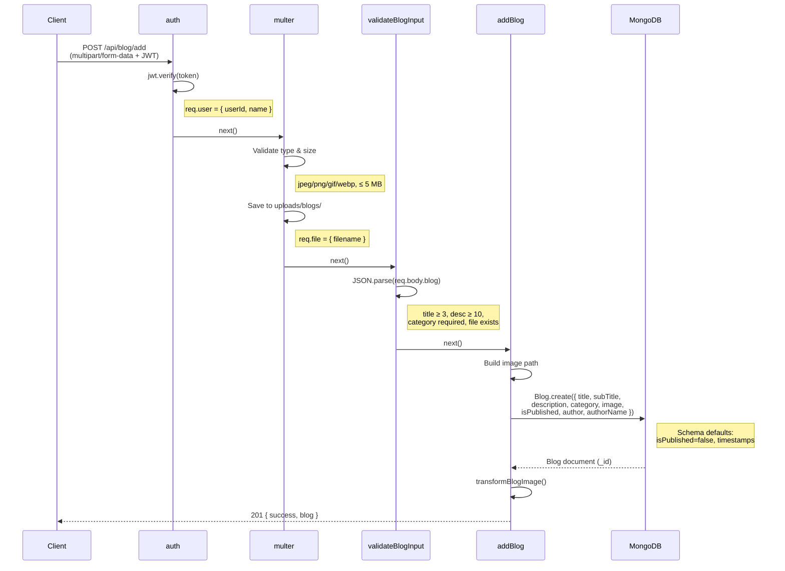
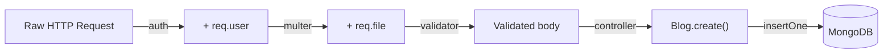
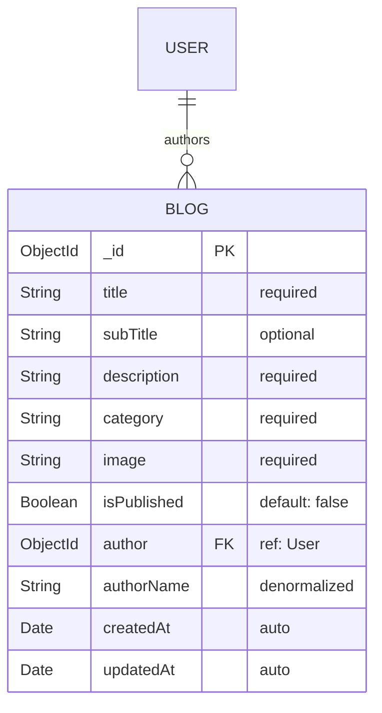

# Post Creation — Backend Flow (API → Database)

## Request Lifecycle

## Request Enrichment

## Error Responses

| Middleware | Cause | Status |
|-----------|-------|--------|
| `apiLimiter` | > 100 req/min per IP | 429 |
| `auth` | Missing / expired / invalid JWT | 401 |
| `multer` | Wrong file type or > 5 MB | 500 |
| `validateBlogInput` | title < 3, desc < 10, no category, no file | 400 |
| `addBlog` | Missing required fields | 400 |
| Mongoose | Schema validation failure | 500 |

## Blog Document (MongoDB)

