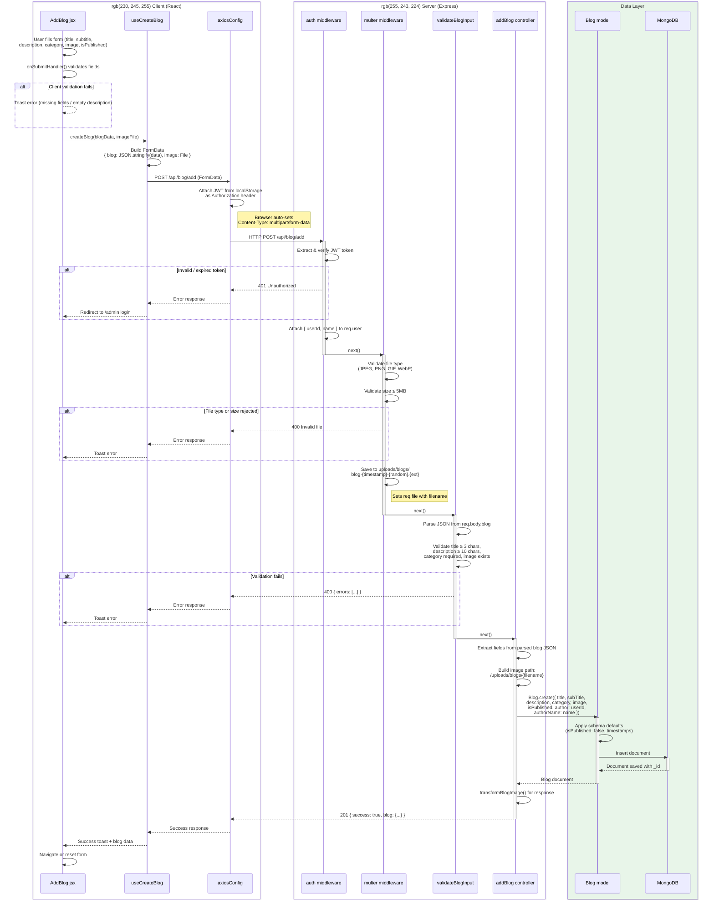

# Post Creation Flow — UI to Database

```mermaid
sequenceDiagram
    box rgb(230, 245, 255) Client (React)
        participant UI as AddBlog.jsx
        participant Hook as useCreateBlog
        participant Axios as axiosConfig
    end

    box rgb(255, 243, 224) Server (Express)
        participant Auth as auth middleware
        participant Multer as multer middleware
        participant Valid as validateBlogInput
        participant Ctrl as addBlog controller
    end

    box rgb(232, 245, 233) Data Layer
        participant Model as Blog model
        participant DB as MongoDB
    end

    UI->>UI: User fills form (title, subtitle,<br/>description, category, image, isPublished)
    UI->>UI: onSubmitHandler() validates fields

    alt Client validation fails
        UI-->>UI: Toast error (missing fields / empty description)
    end

    UI->>Hook: createBlog(blogData, imageFile)
    Hook->>Hook: Build FormData<br/>{ blog: JSON.stringify(data), image: File }
    Hook->>Axios: POST /api/blog/add (FormData)

    Axios->>Axios: Attach JWT from localStorage<br/>as Authorization header
    Note right of Axios: Browser auto-sets<br/>Content-Type: multipart/form-data

    Axios->>Auth: HTTP POST /api/blog/add

    activate Auth
    Auth->>Auth: Extract & verify JWT token
    alt Invalid / expired token
        Auth-->>Axios: 401 Unauthorized
        Axios-->>Hook: Error response
        Hook-->>UI: Redirect to /admin login
    end
    Auth->>Auth: Attach { userId, name } to req.user
    Auth->>Multer: next()
    deactivate Auth

    activate Multer
    Multer->>Multer: Validate file type<br/>(JPEG, PNG, GIF, WebP)
    Multer->>Multer: Validate size ≤ 5MB
    alt File type or size rejected
        Multer-->>Axios: 400 Invalid file
        Axios-->>Hook: Error response
        Hook-->>UI: Toast error
    end
    Multer->>Multer: Save to uploads/blogs/<br/>blog-{timestamp}-{random}.{ext}
    Note right of Multer: Sets req.file with filename
    Multer->>Valid: next()
    deactivate Multer

    activate Valid
    Valid->>Valid: Parse JSON from req.body.blog
    Valid->>Valid: Validate title ≥ 3 chars,<br/>description ≥ 10 chars,<br/>category required, image exists
    alt Validation fails
        Valid-->>Axios: 400 { errors: [...] }
        Axios-->>Hook: Error response
        Hook-->>UI: Toast error
    end
    Valid->>Ctrl: next()
    deactivate Valid

    activate Ctrl
    Ctrl->>Ctrl: Extract fields from parsed blog JSON
    Ctrl->>Ctrl: Build image path:<br/>/uploads/blogs/{filename}
    Ctrl->>Model: Blog.create({ title, subTitle,<br/>description, category, image,<br/>isPublished, author: userId,<br/>authorName: name })
    activate Model

    Model->>Model: Apply schema defaults<br/>(isPublished: false, timestamps)
    Model->>DB: Insert document
    activate DB
    DB-->>Model: Document saved with _id
    deactivate DB
    Model-->>Ctrl: Blog document
    deactivate Model

    Ctrl->>Ctrl: transformBlogImage() for response
    Ctrl-->>Axios: 201 { success: true, blog: {...} }
    deactivate Ctrl

    Axios-->>Hook: Success response
    Hook-->>UI: Success toast + blog data
    UI->>UI: Navigate or reset form
```
